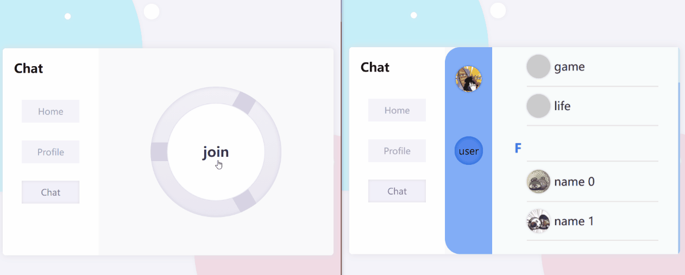

# simple-chatapp


# Preview

## imgtu.com CDN

```html

```


## Github[./preview]




# Usage

  1. **make sure you have [node](https://nodejs.org) env**

  2. **clone / download project**

  3. **enter folder [chat-page] & [chat-server]**

  4. **install node_modules**

  5. **config site**

     * **./chat-page/assets/API.ts**

       ```typescript
       // cross-domain or not
       const needCross: boolean = true;
       
       // cross-domain server or same domain server
       const BASE_PATH: string = needCross ? 'http://sss.sss.sss:sss/' : '/';
       ```

     * **./chat-server/assets/config.js**

       ```js
       module.exports = {
           // cross-domain or not
           cross: true,
           // only cross=true  need this property
           origin: 'http://ccc.ccc.ccc:ccc'
       }
       ```


  6. **open your terminal**

       ```bash
       cd ./chat-server
       node ./bin/www
       ```

       ```bash
       cd ./chat-page
       # you can build it: yarn build
       yarn serve
       ```

  7. **open http://192.168.247:8080 (see the real website on your terminal) in your browser(chrome/firefox/...)**


